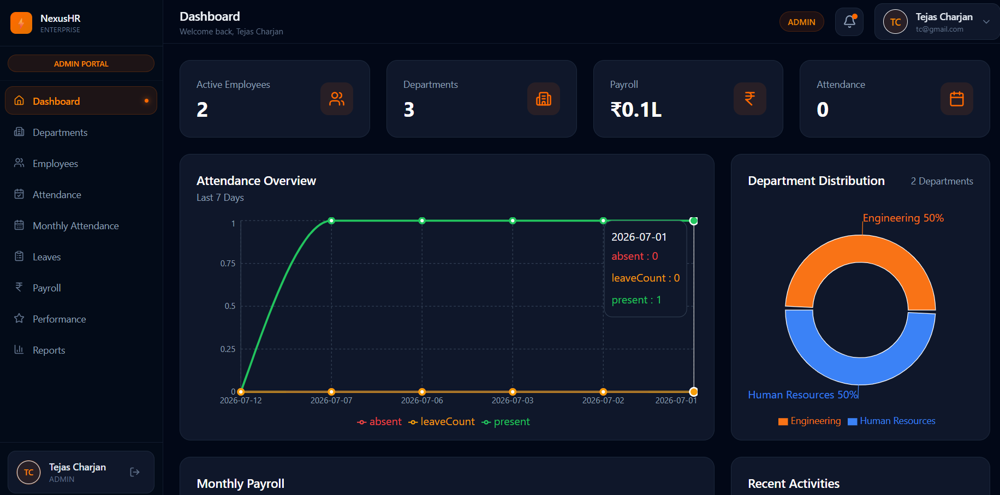
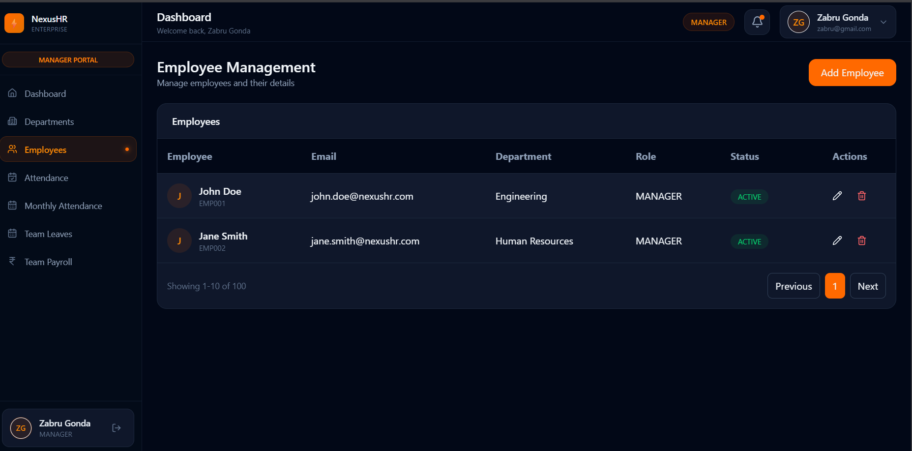
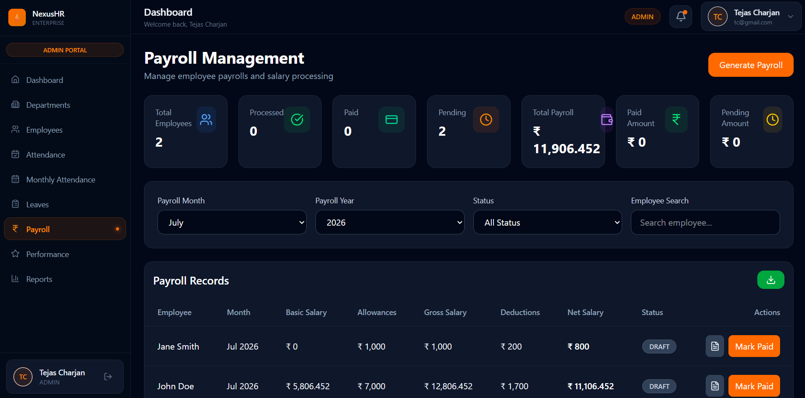

# ⚡ NexusHR — Enterprise Human Resource Management System

NexusHR is a modern, enterprise-grade Human Resource Management System (HRMS) designed to streamline personnel, leave, attendance, and payroll operations. Built with a robust **Spring Boot** backend and a responsive, high-performance **React + Tailwind CSS** frontend, it provides an intuitive interface for employees, HR managers, and administrators.

---

## 📸 Interface Preview

<p align="center">
  
</p>
<p align="center">
  <strong>Figure 1:</strong> NexusHR Admin Dashboard — Workforce Analytics & Core Metrics
</p>

<br />

<p align="center">
  
  
</p>
<p align="center">
  <strong>Figure 2:</strong> Employee Management (Left) and Payroll Calculation & Payslips (Right)
</p>

---

## ✨ Key Features

### 👤 Employee & Core HR Management

- **Centralized Profiles:** Complete record-keeping including personal details, address information, work history, and custom compensation parameters.
- **Organizational Hierarchy:** Structured mapping of departments, roles, and employment types.
- **Compensation History:** Automated audit trails for promotions and base salary adjustments.

### 📅 Attendance & Leave Tracking

- **Real-time Attendance:** Easy check-in/out logging with dynamic duration calculation.
- **Monthly Reviews:** Aggregate views for employees and managers to monitor attendance patterns.
- **Leave Workflow:** Custom leave request submissions, balance audits, and an interactive HR approval lifecycle.

### 💰 Automated Payroll Engine

- **Salary Calculation:** Dynamic determination of gross earnings, allowance additions, and deduction calculations.
- **Document Generation:** Built-in PDF payroll slips generation using the `iText` library.
- **Status Auditing:** Complete tracking of monthly payroll status (Draft, Processed, Approved, Disbursed).

### 🔒 Enterprise Security

- **Stateless Auth:** Secure JSON Web Tokens (JWT) for authentication.
- **Role-Based Access Control (RBAC):** Customized access for Administrators, Managers, and Employees.
- **Form Validation:** Multi-tier field validation checks on both backend and frontend layers.

---

## 🛠️ Technology Stack

| Layer              | Technology                             | Description                                                |
| :----------------- | :------------------------------------- | :--------------------------------------------------------- |
| **Frontend**       | React 19, TypeScript, Vite             | Next-generation components structure and fast builds       |
| **State & Routes** | Redux Toolkit, React Router v7         | Seamless state management and client-side routing          |
| **Styling & UI**   | Tailwind CSS v4, shadcn-ui, Lucide     | Premium design system with interactive component library   |
| **Charts**         | Recharts                               | Responsive data visualization widgets                      |
| **Backend Core**   | Spring Boot 3.5.14, Java 21            | Enterprise Application framework & modern Java runtime     |
| **Security**       | Spring Security, JSON Web Tokens (JWT) | Robust API protection and authentication                   |
| **Database**       | PostgreSQL                             | Relational transactional storage                           |
| **Caching**        | Redis                                  | High-speed data caching and performance enhancement        |
| **Reporting**      | Apache POI, iTextPDF                   | Dynamic Microsoft Excel sheets and PDF document generation |
| **APIs**           | Springdoc-openapi (Swagger v2)         | Interactive REST API testing and documentation             |

---

## 🚀 Getting Started

### 📋 Prerequisites

Make sure you have the following installed on your machine:

- [Java Development Kit (JDK) 21](https://www.oracle.com/java/technologies/downloads/#java21)
- [Node.js (v18 or higher)](https://nodejs.org/)
- [PostgreSQL Database Server](https://www.postgresql.org/)
- [Redis Server](https://redis.io/)

---

### ⚙️ Backend Setup & Run

1.  **Configure Environment:**
    Open the `nexushr/src/main/resources/application.properties` file and update database connection credentials:

    ```properties
    spring.datasource.url=jdbc:postgresql://localhost:5432/nexushr
    spring.datasource.username=YOUR_POSTGRES_USER
    spring.datasource.password=YOUR_POSTGRES_PASSWORD

    spring.data.redis.host=localhost
    spring.data.redis.port=6379
    ```

2.  **Initialize Database:**
    Create a database named `nexushr` in your PostgreSQL instance:
    ```sql
    CREATE DATABASE nexushr;
    ```
3.  **Start Backend Application:**
    Navigate to the `nexushr` directory and use the Maven Wrapper: - **Windows (PowerShell/CMD):**
    `bash
      cd nexushr
      .\mvnw.cmd spring-boot:run
      ` - **Linux/macOS:**
    `bash
cd nexushr
chmod +x mvnw
./mvnw spring-boot:run
`
    The server will startup on port `8080`.

---

### 💻 Frontend Setup & Run

1.  **Navigate and Install Dependencies:**
    Navigate to the `nexushr-frontend` folder:
    ```bash
    cd nexushr-frontend
    npm install
    ```
2.  **Run Development Server:**
    ```bash
    npm run dev
    ```
    The application will launch on your local host (usually `http://localhost:5173`).

---

## 📖 API Documentation & Testing

Once the Spring Boot backend is running, you can access the Swagger UI interface to interactively test the REST endpoints:

- **Swagger URL:** `http://localhost:8080/swagger-ui/index.html`

---

## 📂 Project Structure

```text
NexusHR/
├── nexushr/                  # Spring Boot Backend Codebase
│   ├── src/main/java         # Java Controller, Service, and Repository layers
│   ├── src/main/resources    # Configuration files & assets
│   └── pom.xml               # Maven configuration & dependencies
│
├── nexushr-frontend/         # Vite + React Frontend Application
│   ├── src/
│   │   ├── components/       # Shared UI components (shadcn)
│   │   ├── pages/            # View pages (Dashboard, Employees, Attendance, Payroll)
│   │   └── state/            # Redux store & API integration logic
│   └── package.json          # Node modules configuration
│
└── README.md                 # Project presentation folder (this file)
```

---

## 📄 License

This project is licensed under the MIT License - see the LICENSE file for details.
